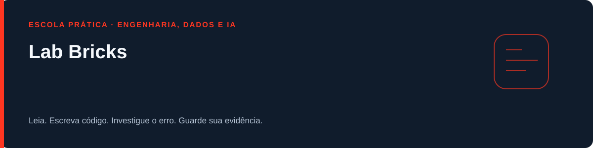
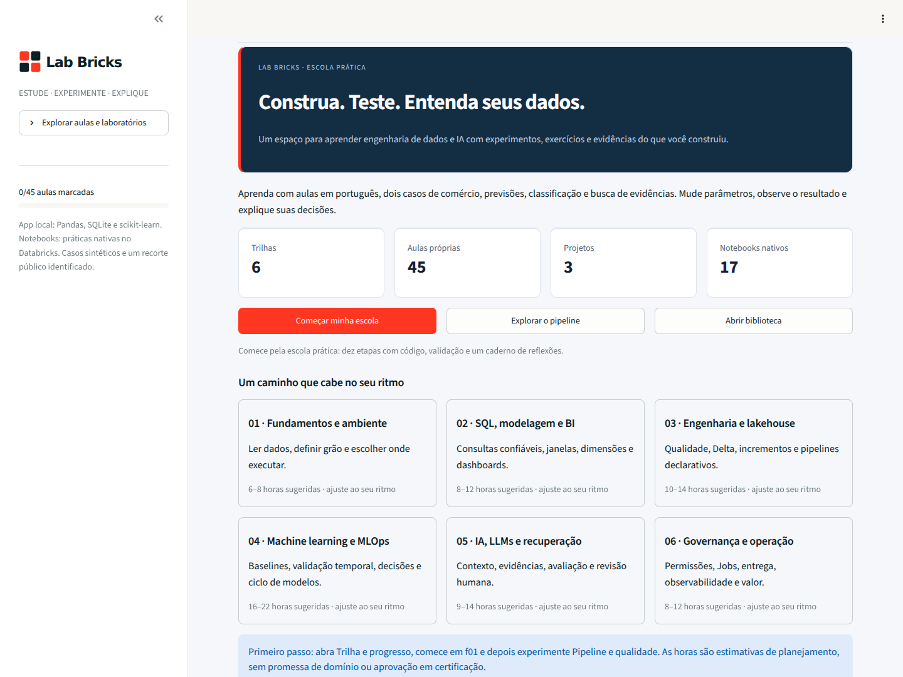
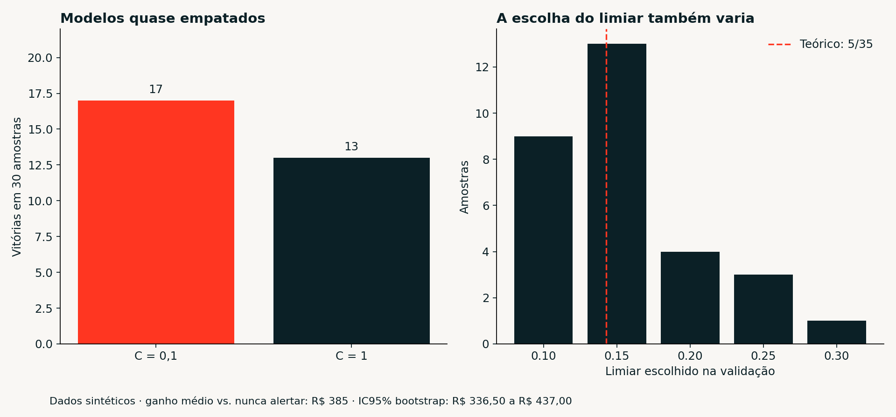
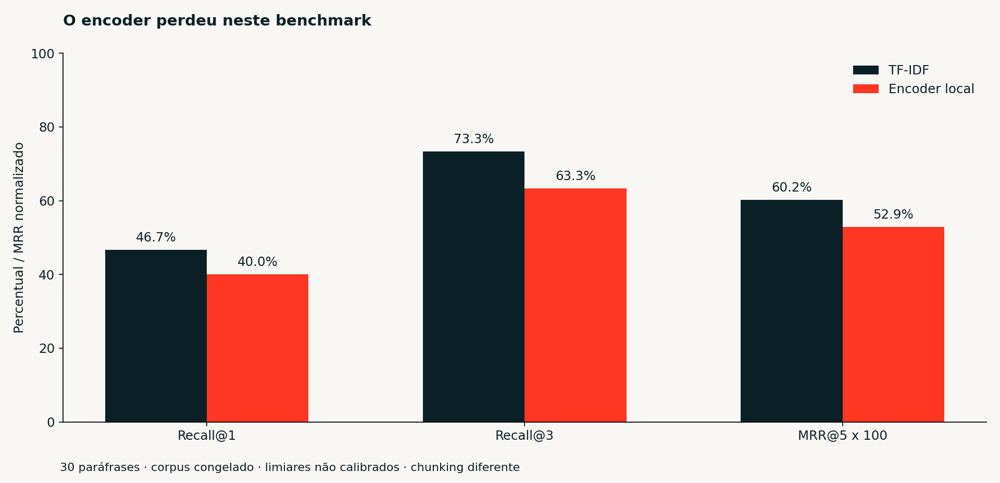

# Lab Bricks - escola prática de dados e Databricks


**Edição 3.0.** Um percurso em português para ler, escrever código, errar, investigar e apresentar evidências. O projeto começou no e-book de Databricks e ganhou aulas próprias, exercícios corrigidos e casos de engenharia, BI, ML e IA.

**Comece pela página Minha escola.** Há 45 aulas em seis trilhas, organizadas em 10 etapas de estudo, 14 exercícios com 64 verificações, 63 questões, três missões SQL, três projetos guiados, 23 páginas no app e 17 notebooks em duas representações. Marcar uma aula como lida não demonstra domínio: produza uma solução, explique um erro e guarde seu resultado.

[Início rápido](#rodar-no-vs-code) · [Guia da escola](docs/GUIA_ESCOLA.md) · [Trilha](docs/TRILHA.md) · [Execução no Databricks](docs/REGISTRO_EXECUCAO_DATABRICKS.md)

## Escola e laboratórios



A página inicial oferece acesso direto à escola, ao pipeline e à biblioteca. O menu completo dos laboratórios fica em uma seção expansível; o progresso continua disponível na lateral.

## Rodar no VS Code

A versão validada usa **Python 3.12**. Se o seu `python3` aponta para 3.14, crie o ambiente com o executável 3.12 explicitamente. No macOS com Homebrew:

```bash
brew install python@3.12
cd lab-bricks
"$(brew --prefix python@3.12)/bin/python3.12" -m venv .venv
source .venv/bin/activate
python -m pip install -r requirements.lock
python scripts/iniciar.py
```

O último comando usa o Python do ambiente, anuncia o endereço e inicia o Streamlit em localhost. Se o navegador não abrir, acesse **http://localhost:8501**. Em outro terminal no macOS: `open http://localhost:8501`.

No Linux, use `python3.12 -m venv .venv` e ative com `source .venv/bin/activate`. No Windows, use `py -3.12 -m venv .venv` e `.venv\Scripts\Activate.ps1`. Depois, os comandos de instalação e início são os mesmos. No VS Code, selecione o interpretador da pasta .venv.

O app funciona sem conta Databricks e sem baixar modelos de IA. O comando direto também funciona:

```bash
python -m streamlit run app.py --server.address localhost --server.headless false
```

## Aprender fazendo

1. Abra Minha escola e escolha a primeira etapa.
2. Leia problema, conceito, exemplo, prática e erros comuns da aula.
3. Edite o exercício em `exercicios/`, escrevendo o núcleo da solução.
4. Rode `python scripts/corrigir.py ex01_grao`. Comece pelo erro apontado; consulte a solução depois da sua tentativa.
5. Importe o feedback em Minha escola e registre sua explicação. Exporte o caderno pessoal para conservar o trabalho.
6. Resolva as missões SQL e conclua um projeto com a rubrica e seu relatório.

O caderno fica na sessão, não em uma conta remota. Feedback é um registro pessoal editável, não certificado. Atualizações do laboratório não devem sobrescrever exercícios já resolvidos por você. [Guia da escola](docs/GUIA_ESCOLA.md) e [trilha completa](docs/TRILHA.md).

## O que a revisão acrescentou

- Escrita de código: métricas à mão, logística em NumPy, contratos, divisão temporal, SQL com CTE e janela, MERGE idempotente, watermark e citações.
- Caso público real: amostra rastreável do UCI Online Retail; Bronze, Silver, quarentena e Gold com moeda preservada e reconciliação.
- ML: validação temporal com gap, calibração com conjuntos separados, custo de decisão, instabilidade da seleção e monitoramento com ação.
- Engenharia: CDC, histórico SCD tipo 2, exclusão e reinserção, eventos atrasados e replay de checkpoint.
- IA: comparação lexical/semântica no mesmo benchmark, resposta extrativa com citações e avaliação exploratória de um gerador local.
- Estudo contínuo: reflexões por aula, feedback importável, catálogo extensível e modelo de relato para portfólio.

Os sete exercícios e as melhorias corretas da versão 2.1 foram preservados. A [análise técnica](docs/ANALISE_V2_1.md) descreve o que mudou e o que continua pendente. Veja também [diferenças em relação ao e-book](docs/MUDANCAS_EM_RELACAO_AO_EBOOK.md).

## Resultados que merecem ser estudados

**Dados reais:** 3.000 linhas = 2.946 válidas + 10 rejeitadas + 44 duplicatas substituídas. A Gold registra GBP 56.820,33 de receita líquida, após estornos. A amostra corresponde a um dia; serve para engenharia e BI, não para validar previsão temporal. [Proveniência e contrato](docs/DADOS_REAIS.md).

**Instabilidade:** em 30 conjuntos sintéticos, C=0,1 venceu 17 vezes e C=1 venceu 13. O limiar mediano foi 0,15; o limiar teórico 5/35 só se aplica com probabilidades calibradas e as hipóteses de custo declaradas. Ganho médio de R$ 385 sobre nunca alertar, IC bootstrap [R$ 336,50; R$ 437,00], restrito ao gerador sintético. Na previsão de vendas, o modelo também enfrenta ontem, semana passada e média do treino; o app avisa quando não ganha da média.



**Busca:** 30 paráfrases e seis perguntas fora do escopo, corpus original de 35 aulas congelado antes de ampliar a escola.

| Método | Recall@1 | Recall@3 | MRR@5 |
|---|---:|---:|---:|
| TF-IDF | 46,7% | 73,3% | 0,602 |
| Encoder multilíngue local | 40,0% | 63,3% | 0,529 |

O encoder perdeu em recuperação neste recorte. Mudanças de chunking e limiares impedem atribuir tudo ao modelo. A abstenção também troca cobertura por precisão. [Protocolo e reprodução](docs/BUSCA_SEMANTICA.md).



**Geração local:** sete casos foram realmente executados com Qwen2.5-0.5B e llama.cpp. Todos os sete outputs falharam no contrato e viraram abstenção; nenhuma resposta útil foi aceita. Isso é um resultado negativo registrado, não um RAG pronto para uso. O app oferece a resposta extrativa; a geração é uma experiência opcional. [Avaliação e limites](docs/RAG_LOCAL.md).

## O que foi validado

- 169 testes de manutenção aprovados, incluindo abertura das 23 páginas e verificação dos exercícios.
- 64 testes de aluno: referências passam; esqueletos vazios não aprovam.
- Sete cenários Spark 4.0.1 executados localmente, incluindo Gold público e streaming com replay.
- 69 pacotes fixados consultados no OSV, sem advisories retornados na consulta registrada.
- Pares de notebooks coerentes com os módulos, links locais, catálogo, hashes, limites de entrada e busca limitada de padrões de segredo.

**Execução em uma conta Databricks continua pendente.** Spark local não valida Delta, Unity Catalog, Jobs, MLflow, Auto Loader ou permissões de workspace. Os 17 notebooks têm registro próprio para data, versão, run ID/link e falhas. [Relatório](docs/RELATORIO_VALIDACAO.md) e [registro nativo](docs/REGISTRO_EXECUCAO_DATABRICKS.md).

O checklist de segurança solicitado está mapeado em [21 temas](docs/AUDITORIA_SEGURANCA.md), com controles locais e pendências de hospedagem identificadas. Não é certificação de segurança.

## Evoluir sem perder o aprendizado

Use [CONTRIBUTING](CONTRIBUTING.md), [roadmap](docs/ROADMAP.md) e o [prompt de continuidade](docs/PROMPT_MELHORIAS.md). Aulas são Markdown com metadados; catálogo, trilha e questões são verificáveis. Não altere perguntas congeladas para aumentar métricas. Acrescente um novo protocolo quando fizer outro experimento.

Escreva seu próprio relato com [este modelo](docs/ESTUDO_CASO_TEMPLATE.md). Explique o que você tentou, qual baseline ganhou, o erro que encontrou e o que mudou. Este repositório fornece experiências; a evidência do seu aprendizado vem da execução e da sua explicação.

## Verificação e entrega

```bash
python scripts/build_school_notebooks.py
python scripts/export_notebooks.py
python scripts/verify_project.py
python -m pytest
python scripts/audit_dependencies.py
python scripts/package_project.py ../lab-bricks-v3.0.zip
```

[GitHub e atualização segura](docs/COMO_SUBIR_GITHUB.md). O pacote exclui ambientes, caches, modelos, outputs pessoais, segredos, livros anexados e arquivos temporários.

Código e conteúdo próprios: MIT. A amostra pública mantém atribuição **CC BY 4.0** em [data/LICENSES.md](data/LICENSES.md). Os livros enriqueceram os temas; não são reproduzidos ou redistribuídos. Projeto independente, sem vínculo oficial com Databricks.
