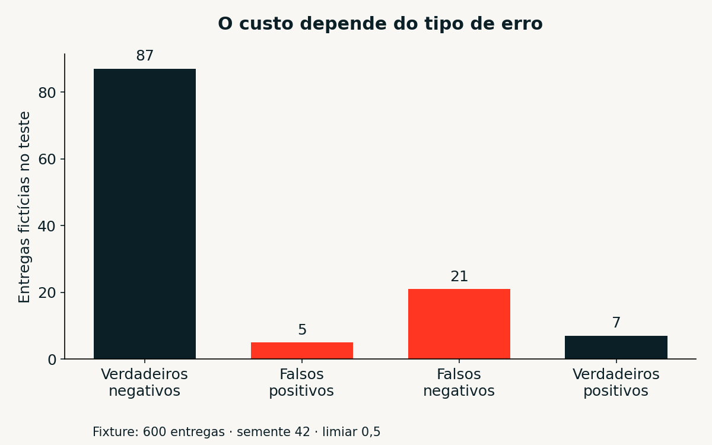

# Lab Bricks

Um laboratório em português para aprender Databricks com **33 aulas próprias, 12 notebooks, três projetos e experiências interativas**. Você estuda conceitos, muda parâmetros, observa resultados e constrói evidências do que aprendeu.

[](https://github.com/bruno-dsn/lab-bricks/actions/workflows/ci.yml)

**Comece por [f01: mapa e ambiente](content/aulas/f01-mapa.md)**, siga a [trilha completa](docs/TRILHA.md) e abra o app para experimentar. O conteúdo é independente; dados, marca, código, exercícios e perguntas são próprios. A paleta usa Lava, Navy e Oat como inspiração visual do Databricks.

## O que você vai construir

| Trilha | O que pratica | Evidência |
|---|---|---|
| Fundamentos | Ambiente, grão, DataFrames, contratos, reprodução | Contrato e reconciliação |
| SQL e BI | Agregações, joins, CTEs, janelas e dashboards | Queries e indicadores confiáveis |
| Engenharia | Medallion, Delta, MERGE, JSON, Auto Loader e pipeline declarativa | Lakehouse e gates de qualidade |
| Machine learning | Baseline, corte temporal, classificação, custo, MLflow e drift | Experimento e política de decisão |
| IA e recuperação | LLMs, busca lexical, desenho RAG, avaliação e supervisão | Evidências, benchmark e abstenção |
| Governança | Unity Catalog, Jobs, bundles, CI, observabilidade e evolução | Matriz de acesso e runbook |

Cada aula possui problema, conceito, exemplo explicado, prática, resultado esperado, erros comuns, desafio, critério de conclusão e referências. As **39 perguntas comentadas** são originais. O [mapa dos materiais](docs/FONTES.md) explica o que cada referência acrescentou e quais instruções antigas foram atualizadas.

## Rode o laboratório local

Use **Python 3.12**. O lock inclui as dependências do app, testes e geração de imagens.

```bash
git clone https://github.com/bruno-dsn/lab-bricks.git
cd lab-bricks
python -m venv .venv
```

Ative o ambiente:

```bash
# Linux / macOS
source .venv/bin/activate
# Windows PowerShell
# .venv\Scripts\Activate.ps1
```

Depois:

```bash
python -m pip install -r requirements.lock
python -m streamlit run app.py
```

O app oferece 13 páginas: início, trilha/progresso, biblioteca, pipeline, SQL, BI, incrementos, previsão, classificação, ciclo de ML, recuperação, perguntas e inclusão de conteúdo. O progresso fica na sessão: **exporte o JSON para guardar e importe para restaurar**. Não há cadastro nem banco compartilhado de alunos.

## Faça experiências que ensinam

- **Pipeline:** inspecione 727 registros → 720 pedidos válidos, seis rejeitados e uma versão substituída no cenário padrão.
- **BI:** use pedidos com vários itens, quatro tabelas e joins; compare linhas, pedidos e unidades. Receita e margem usam preço/custo da transação.
- **Incrementos:** repita lotes, receba eventos antigos e correções inválidas; observe manifesto e versão vigente.
- **ML:** compare Ridge com repetir ontem; classifique risco de atraso com corte temporal, baseline, matriz de confusão e custos ilustrativos.
- **IA:** recupere trechos das aulas e avalie recall@k. A busca usa TF-IDF; **não executa geração por LLM** nem chama serviços externos.




## Pratique no Databricks

Importe os arquivos `.py` ou `.ipynb` de [notebooks](notebooks), preservando seus nomes e a mesma pasta. Execute `00_configuracao` em um catálogo de estudo autorizado. O schema `lb_<hash>` reduz colisão de nomes; **privilégios Unity Catalog controlam o acesso**.

| Notebook | Experiência |
|---|---|
| 00 | Catálogo, namespace e fonte reproduzível |
| 01 | Spark SQL e agregações |
| 02 | Bronze, Silver, quarentena e Gold em Delta |
| 03 | MERGE idempotente e comparação de conteúdo |
| 04 | Previsão sem vazamento; Tracking opcional |
| 05 | Modelagem BI, joins e janelas |
| 06 | JSON aninhado e quarentena de mensagens/itens |
| 07 | Gate de qualidade para Jobs |
| 08 | Auto Loader em volume próprio, opcional |
| 09 | Classificação temporal e drift exploratório |
| 10 | Recuperação lexical e evidências |
| 11 | Features point-in-time, seleção 60/20/20 e contrato; MLflow 3 opcional |

Consulte o [guia nativo](docs/GUIA_DATABRICKS.md), o [registro de validação](docs/VALIDACAO_DATABRICKS.md) e [MLflow/operação](docs/MLFLOW_E_OPERACAO.md). Há também uma [pipeline declarativa](pipelines/qualidade_declarativa.py) e um [bundle de Job](databricks.yml) para implantação manual em ambiente de estudo.

**Escopo da validação:** os testes automatizados exercitam o app e as funções locais; há validação de cenários específicos em Spark local. Delta, Unity Catalog, Jobs, Auto Loader, pipelines e MLflow precisam de execução e permissões na sua conta. Importar um notebook não comprova essa execução. O [mapa de certificação](docs/CERTIFICACAO.md) indica cobertura e lacunas, sem promessa de aprovação.

Veja o [ciclo completo de ML](docs/CICLO_ML.md): disponibilidade das features, seleção na validação, teste final e contrato de inferência.

## Construa seu portfólio

1. [Lakehouse que merece confiança](content/projetos/01-lakehouse-confiavel.md): contratos, reconciliação, incrementos e operação.
2. [Painel sem receita multiplicada](content/projetos/02-bi-decisao.md): grão, métricas, filtros e decisão.
3. [Modelos e assistência com evidências](content/projetos/03-ml-ia-evidencias.md): avaliação temporal, custo, busca e supervisão.

As rubricas pedem resultados reproduzíveis, não apenas screenshots. O ritmo sugerido para as seis trilhas é **54–78 horas**, além dos projetos; ajuste conforme sua experiência e disponibilidade. Veja [desafios e soluções orientadas](docs/DESAFIOS.md).

## Acrescente conteúdos e mantenha a trilha viva

A página **Adicionar conteúdo** gera um template para baixar. Pelo terminal:

```bash
python scripts/new_lesson.py --id g06-minha-pratica \
  --title "Minha próxima prática" --track governanca
python scripts/verify_project.py
python -m pytest
```

Preencha `content/aulas/*.md` com cabeçalho TOML, ID estável, trilha, objetivos, fontes e pré-requisitos. O app descobre aulas válidas automaticamente. Acrescente fontes em `content/sources.json`, questões em `content/questions.json` e projetos em `content/projetos`. O verificador detecta referências inexistentes, IDs duplicados e ciclos de pré-requisitos. Leia [como contribuir](CONTRIBUTING.md).

## Valide e monte uma entrega limpa

```bash
python scripts/export_notebooks.py
python scripts/verify_project.py
python -m pytest
python scripts/audit_dependencies.py
python scripts/package_project.py ../lab-bricks-v2.0.zip
```

O ZIP seleciona fontes explicitamente e exclui Git, ambientes, caches, logs, progresso pessoal e referências PDF. Os notebooks são exportados sem saídas. A CI repete validação, testes e auditoria; não contém credenciais nem faz deploy na sua conta.

O [checklist de segurança NotKode](docs/AUDITORIA_SEGURANCA.md) foi aplicado ao escopo local. Acesso real, permissões, rate limits e políticas da hospedagem permanecem verificações do ambiente concreto.

## Referências e licença

Os seis materiais novos enriqueceram os temas com conteúdo original. **Os livros/PDFs, suas imagens e questões de exame não são redistribuídos.** Leia [fontes e atualizações](docs/FONTES.md), [mudanças em relação ao e-book](docs/MUDANCAS_EM_RELACAO_AO_EBOOK.md) e o [roadmap](docs/ROADMAP.md).

Código e materiais próprios: [MIT](LICENSE). Databricks e marcas de terceiros pertencem aos respectivos titulares. Lab Bricks é um projeto educacional independente de Bruno Nunes.
