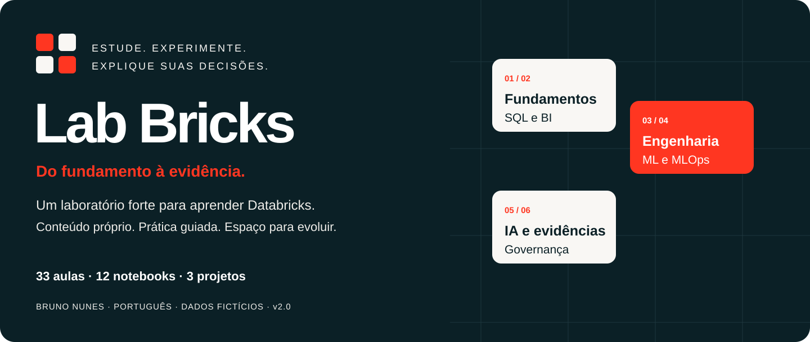
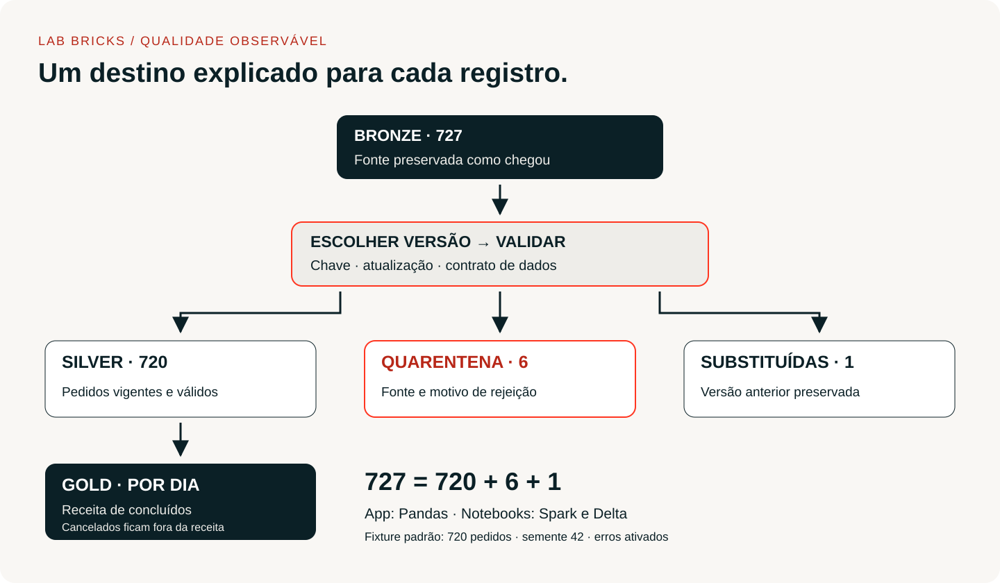
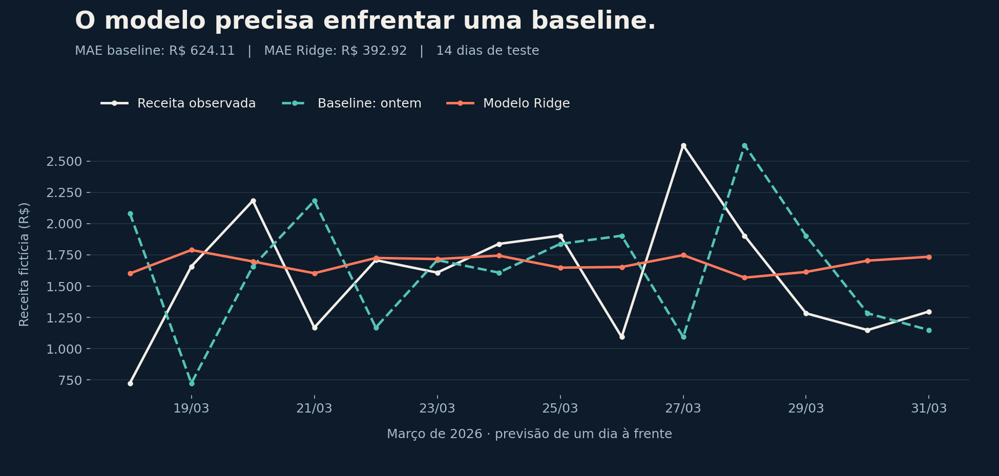

# Databricks na prática

Uma trilha em português para aprender SQL, Spark, Delta Lake e avaliação de modelos construindo um projeto de vendas. Você lê a regra, muda o exemplo e confere o resultado.

**Comece sem conta:** o laboratório local permite explorar dados fictícios, acompanhar a limpeza, escrever SQL e comparar uma previsão com uma baseline. Depois, os cinco notebooks levam o caso para o Databricks.

Projeto educacional independente de **Bruno Nunes**. Os exemplos, textos e dados deste repositório foram desenvolvidos para esta trilha. O ebook que inspirou a conversa está creditado em [Fontes](docs/FONTES.md).

## Experimente em poucos passos

Use Python **3.12**. No terminal, dentro da pasta deste repositório:

```bash
python3 -m venv .venv
source .venv/bin/activate
python -m pip install -r requirements.lock
python -m streamlit run app.py --server.address 127.0.0.1
```

No Windows, ative o ambiente com `.venv\Scripts\activate`. Abra o endereço local informado no terminal. O app funciona sem token, sem login e sem conexão com sua conta Databricks.

No menu você encontra **Visão geral**, **Pipeline e qualidade**, **Laboratório SQL**, **Previsão de vendas** e **Teste seu raciocínio**. Mude o tamanho da amostra, a semente ou os erros da fonte e observe as consequências.

## O projeto que você vai construir



A loja tem um problema concreto: a receita muda conforme alguém inclui cancelamentos ou conta o mesmo pedido duas vezes. Você vai receber a fonte, escolher a versão mais recente de cada pedido, rejeitar registros inválidos e reconciliar as métricas.

Na amostra padrão, **727 registros recebidos = 720 pedidos na Silver + 6 rejeitados + 1 versão substituída**. A receita considera somente pedidos concluídos. Cada pedido tem um único produto.

| Etapa | Resultado que você consegue explicar | Material |
|---|---|---|
| Entender a plataforma | Diferenciar Databricks, Spark, Delta e Unity Catalog | [Fundamentos](docs/01_FUNDAMENTOS.md) |
| Fazer perguntas com SQL | Receita, unidades, ticket e cancelamentos | [Notebook 01](notebooks/01_sql_sem_misterio.ipynb) |
| Construir o lakehouse | Bronze, Silver, Gold e quarentena | [Notebook 02](notebooks/02_lakehouse_vendas.ipynb) |
| Receber novas versões | MERGE com reprocessamento sem duplicação | [Notebook 03](notebooks/03_delta_incremental.ipynb) |
| Avaliar uma previsão | Teste temporal e comparação com baseline | [Notebook 04](notebooks/04_ml_sem_vazamento.ipynb) |

[Início e instalação](docs/00_COMECE_AQUI.md) · [Trilha de estudo](docs/TRILHA.md) · [Desafios](docs/DESAFIOS.md) · [Gabaritos](docs/SOLUCOES.md) · [Como subir no GitHub](docs/COMO_SUBIR_GITHUB.md)

## O que foi acrescentado ao ebook

A introdução inspirou uma trilha executável: dados próprios, laboratório interativo, cinco notebooks, exercícios e verificações automáticas. A comparação completa está em [O que mudou em relação ao ebook](docs/MUDANCAS_EM_RELACAO_AO_EBOOK.md).

| Acréscimo | Para que serve |
|---|---|
| Pipeline com quarentena e versões | Explicar por que um registro entra ou sai da receita |
| SQL com controles no servidor | Experimentar consultas sobre dados fictícios com limites de leitura |
| MERGE e histórico Delta | Entender atualização e reprocessamento sem duplicar pedidos |
| Modelo e baseline com teste temporal | Avaliar uma previsão usando apenas informações disponíveis no momento |
| Auditoria e pacote limpo | Revisar segurança e publicar fontes sem saídas, segredos ou caches |

## Execute no Databricks

Crie uma conta na **Databricks Free Edition** para estudar. Ela usa compute serverless com limites de uso e é destinada a uso não comercial. [Referência oficial](https://docs.databricks.com/aws/en/getting-started/free-edition-limitations).

Importe os arquivos `.py` de `notebooks/` para uma mesma pasta no Workspace. Execute `00_configuracao` e siga a ordem numérica. Escolha um catálogo de estudo em que tenha permissão de criação; use o mesmo catálogo em todos os notebooks.

Os `.py` são a fonte canônica e os `.ipynb` permitem ler as células no GitHub. **O laboratório e a transformação Spark foram testados localmente; a execução completa dos notebooks na conta Databricks ainda precisa ser validada.** Veja o roteiro de [validação na conta](docs/VALIDACAO_DATABRICKS.md).

| Ambiente | Motor | O que comprova |
|---|---|---|
| App local | Pandas, SQLite, scikit-learn | Regras de negócio, editor SQL e avaliação temporal |
| Verificação Spark local | PySpark 4.0.1 | Transformação do notebook 00 reconciliada com Pandas em três cenários |
| Notebooks na sua conta | Spark, Spark SQL, Delta; MLflow opcional | Tabelas, histórico e permissões no Databricks |

O editor local usa SQLite. Funções de data, tipos e alguns comandos diferem de Spark SQL. Ele não mede desempenho distribuído.

## Um resultado que dá para inspecionar



Gráfico gerado pelo código deste repositório, com a amostra padrão. A comparação é de **um dia à frente**, usando o passado já observado em cada dia do teste. Leia a [explicação do experimento](docs/05_MACHINE_LEARNING.md) antes de interpretar o erro.

## Qualidade e segurança

```bash
python -m pytest
python scripts/verify_project.py
python scripts/audit_dependencies.py
```

A CI repete os testes, confere os arquivos e consulta advisories no OSV. As dependências diretas e transitivas estão fixadas em `requirements.lock`.

Na revisão de 6 de outubro de 2026, passaram **54 testes locais** e **três cenários Spark**. O teste Spark compara a função real `normalizar` do notebook com Pandas, incluindo campos nulos, ordem de chegada e versões inválidas. Ele é opcional, exige Java 17 ou superior e as dependências de `requirements-spark.txt`:

```bash
python -m pip install -r requirements-spark.txt
python scripts/verify_spark.py
```

Para montar uma entrega sem caches, ambientes, ZIPs anteriores ou saídas de notebook, salve o arquivo fora da pasta do projeto:

```bash
python scripts/package_project.py ../databricks-na-pratica-v1.0.zip
```

O editor SQL trabalha apenas sobre uma cópia temporária dos dados fictícios. O servidor bloqueia escrita, acesso a arquivos, extensões e consultas recursivas; também limita o tamanho da consulta, o resultado e as instruções processadas.

Os **21 pontos da NotKode** estão mapeados no [relatório de segurança](docs/AUDITORIA_SEGURANCA.md), com evidências e pendências. A inspeção desta versão não substitui testes de acesso na conta nem verificação de um ambiente publicado.

## Organização

| Pasta ou arquivo | Conteúdo |
|---|---|
| `app.py` | Interface interativa do laboratório |
| `src/lab/` | Geração, qualidade, SQL de leitura e ML |
| `notebooks/` | Cinco notebooks nos formatos `.py` e `.ipynb` |
| `data/` | CSV sintético e contrato das colunas |
| `docs/` | Aulas, exercícios, operação e auditoria |
| `assets/` | Imagens originais e gráfico do experimento |
| `tests/`, `scripts/` | Testes e verificações reproduzíveis |

Quer evoluir para um produto? O [roadmap](docs/ROADMAP.md) separa melhorias de ensino, engenharia e operação comercial. Esta versão entrega a trilha inicial; login, pagamentos, integração de contas e um agente com LLM são etapas futuras.

## Contribua

Leia [CONTRIBUTING.md](CONTRIBUTING.md). Ao sugerir um exemplo, inclua a regra explicada, uma entrada pequena e o resultado esperado. Código e conteúdo original sob [licença MIT](LICENSE). Databricks e Apache Spark são marcas de seus respectivos titulares; este projeto não tem vínculo oficial com eles.
